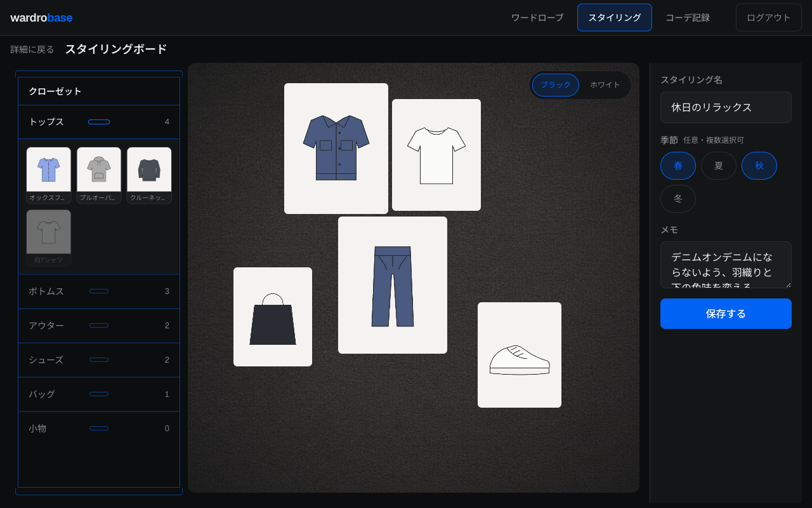
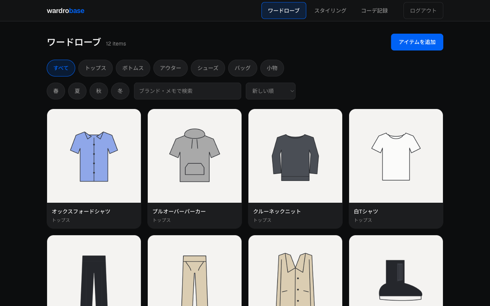
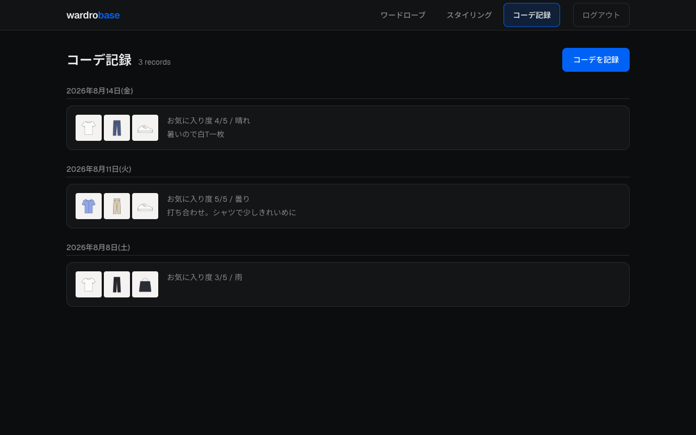
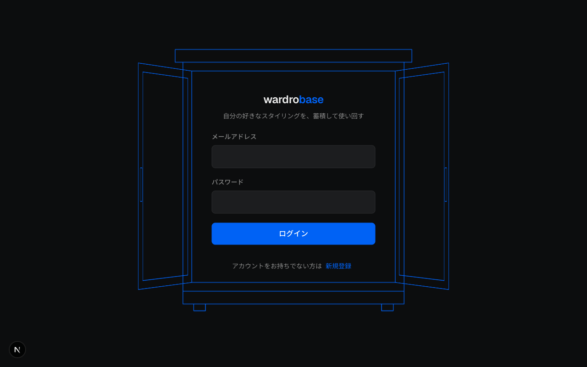
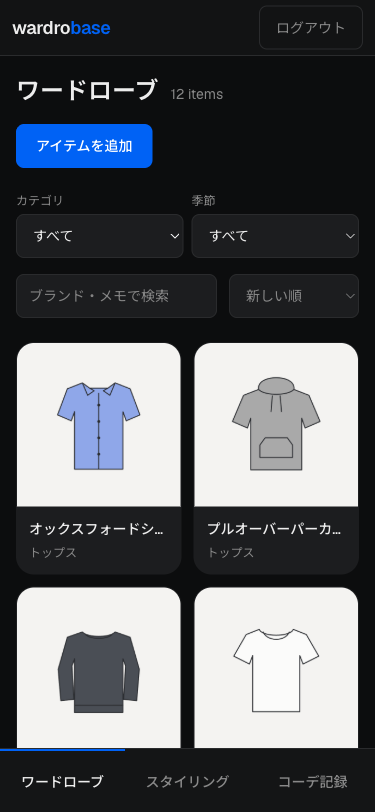

# Wardrobase

**自分の"好き"なスタイリングを、蓄積して使い回すためのワードローブ基盤。**

手持ちの服をすべて登録・可視化し、その中から好みの組み合わせ（スタイリング）を作って保存・再利用する Web アプリです。AI による自動提案には頼らず、**ユーザー自身が組んだスタイリングを資産として蓄積する**ことを中核に据えています。

> Wardrobase = Wardrobe + Base。wardro**be** と **b**ase が b を共有して重なる造語で、「手持ちの服を体系化した基盤」を意味します。

## スクリーンショット

### スタイリングボード

クローゼットの引き出しからカーペットへアイテムをドラッグし、組み合わせを試作するホワイトボード式キャンバス。位置・重なり順・大きさごと保存され、開き直すと同じ見た目で再現されます。



### ワードローブ

登録した服をグリッドで一覧。カテゴリ・色・季節での絞り込みと、ブランド・メモのキーワード検索ができます。



### コーデ記録

「その日に実際に着たコーデ」を記録。保存済みスタイリングから 1 回の選択で起こすこともできます。記録は日付リストで振り返れます。



### ログイン

クローゼットの扉が開いてアプリが始まる、線画の演出。



### モバイル

600px 以下では下部タブバーに切り替わり、ボードは縦積み＋タップ配置で操作できます。



## 主な機能

- **アイテム管理** — 写真アップロード（クライアント側でリサイズ・圧縮・EXIF 回転補正）、カテゴリ・色・季節・ブランド・価格などの属性管理。写真なし登録にも対応
- **ワードローブ一覧** — グリッド表示、フィルタ、キーワード検索、ソート
- **スタイリング** — 好みの組み合わせに名前を付けて保存する「再利用テンプレート」。ボードで自由に配置して作成
- **コーデ記録** — その日に着た実績の記録。お気に入り度・メモ付き。スタイリングからのワンステップ生成に対応
- **着用ログの自動蓄積** — コーデ保存時に着用記録を自動生成。将来の分析機能（稼働率・着用単価）の土台

## 技術スタック

| 領域 | 技術 |
|---|---|
| フレームワーク | Next.js 16 (App Router) / TypeScript / React 19 |
| スタイリング | CSS Modules + CSS 変数によるデザイントークン |
| バリデーション | Zod（フォームと Server Function で同一スキーマを共有） |
| ORM / DB | Prisma 7 / PostgreSQL 17 |
| 認証 | better-auth |
| 画像ストレージ | S3 互換 API（ローカルは MinIO、本番は R2 / S3 に差し替え可能） |
| テスト | Vitest + Testing Library |
| CI | GitHub Actions（PR ごとに lint → test → build） |

## 設計上のこだわり

### 認可はアプリケーション層で多層防御

RLS を使わない構成のため、「userId の絞り忘れ＝他人のデータが見える」に直結します。これを 3 層で防いでいます。

1. `prisma` に触れるのは `infrastructure/` 配下のみ
2. リポジトリ関数は必ず第一引数に `userId` を取り、`findUnique({ where: { id } })` を使わず userId との複合条件で引く
3. 上記ルールをソース検査で機械的に検証するガードレールテスト

Server Function は直接 POST で叩ける前提で、全関数の冒頭でセッションを確認し、サーバー側でも Zod による入力検証を行います。

### 軽量 DDD とテスト戦略

依存を `app / components → application → domain`（`infrastructure → domain`）の一方通行にし、**domain 層は `next/*` も `@prisma/client` も import しない純粋な TypeScript** に保っています。外部依存のない domain 層はテストファーストで実装し、テスト名は `it('着用回数が0のとき着用単価はnullを返す')` のように仕様がそのまま読める日本語にしています。

ESLint は意図的に厳しい設定（`complexity: 5` / `max-lines: 200` など）にし、ルールに当たったら `eslint-disable` ではなく設計を見直す運用です。

### 「実績」と「テンプレート」を分けるデータモデル

その日に着たコーデ（`outfits`）と再利用するスタイリング（`stylings`）は性質が異なるため、テーブルを分けています。スタイリングから着用を記録する際は参照ではなく**コピー**で実績を作り、後からスタイリングを編集しても過去の記録が変わらないようにしています。ボード上の配置（座標・重なり順・大きさ）は「このコーデでこの服をどう置いたか」の情報なので、アイテムではなく結合テーブル側に持たせています。

### ポータビリティ

プラットフォーム固有サービス（Vercel Blob / KV / Postgres）は使わず、画像は `@aws-sdk/client-s3` で S3 API を直接書いています。DB・ストレージとも環境変数の差し替えだけで移行できる構成です。

## ローカルでの起動

Node.js 22 / Docker が必要です。

```bash
# 1. 依存のインストール
npm install

# 2. ローカル環境（Postgres / MinIO / Mailpit）の起動
docker compose up -d

# 3. 環境変数の設定（.env.example を参考に .env を作成）
cp .env.example .env
# BETTER_AUTH_SECRET を `openssl rand -base64 32` の値に置き換える

# 4. スキーマ適用 + Prisma Client 生成
npx prisma migrate dev

# 5. 開発サーバー起動
npm run dev
```

- アプリ: http://localhost:3000
- MinIO 管理画面: http://localhost:9001
- 送信メールの確認（Mailpit）: http://localhost:8025

## テスト・品質チェック

```bash
npm run test    # watch モード
npm run check   # CI と同一内容（lint → test → build）
```

## 今後の予定

- デプロイ・デモログイン（登録なしで中身を試せるように）
- 分析ダッシュボード（稼働率・着用単価・着用回数ランキング）
- 1 タップ着用記録
- ブラウザ内 ML による画像の背景切り抜き（写真を外部に送らずクライアントで完結）
